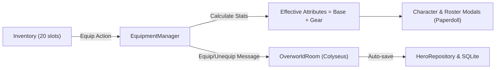

# Equipment and Völundr System Specification

## Objective

Implement an authoritative, extensible Equipment System in Poktsonline allowing both the **Hero** (Isekai Traveler) and **Roster Champions** (Einherjar and Gods) to equip gear across 5 standard slots:

- `weapon`
- `head`
- `armor`
- `boots`
- `accessory`

Equipped items augment combat Attributes, persist across game sessions via SQLite, and display on interactive Paperdoll UI grids in the Character and Roster modals.

---

## Architecture & Data Flow

---

## Requirements

1. **Shared Types & Catalog (`@poktsonline/shared`)**:
   - `EquipmentSlot`: `'weapon' | 'head' | 'armor' | 'boots' | 'accessory'`
   - `EquipmentStats`: `{ atk?: number; def?: number; int?: number; agi?: number; maxHp?: number; maxSp?: number; }`
   - `EquipmentItemDefinition`: extends `ItemDefinition` with `slot: EquipmentSlot; stats: EquipmentStats; requiredLevel?: number;`
   - Mythological catalog of initial equipment items for all 5 slots.

2. **Equip / Unequip Mechanics (`EquipmentManager`)**:
   - Equipping removes 1 quantity of the item from player's inventory.
   - If slot is occupied, previous item is swapped back to inventory.
   - Unequipping checks inventory space (max 20 slots). If full, fails with clear error.
   - Calculates effective attributes dynamically without mutating underlying base level/stat point allocations.

3. **Persistence & Authoritative Server (`@poktsonline/server`)**:
   - `HeroRepository`: stores `equipment` in `heroes` table and champion equipment in `hero_rosters.attributes`.
   - Handlers for `equip_item` and `unequip_item` in `OverworldRoom`.

4. **Client UI & Paperdoll (`@poktsonline/client`)**:
   - Paperdoll in `CharacterModalController` (Hero) with 5 slots and stat delta indicators (`+X`).
   - Paperdoll in `RosterModalController` (Selected Champion) with 5 slots and stat deltas.
   - `InventoryModalController`: `[สวมใส่ / Equip]` button with target selection (Hero vs Roster Champions).
   - Debug toolbar cheats to grant test equipment pieces.

5. **Verification**:
   - 100% test pass rate across all workspaces.
   - Pre-commit hook runs lint-staged, build, and tests cleanly.
